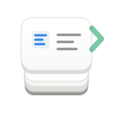
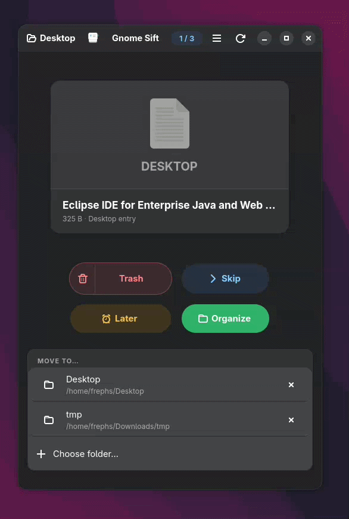

# Sift 

[](https://github.com/frephs/sift/actions/workflows/ci.yml)
[](https://opensource.org/licenses/MIT)
[](https://www.python.org/)
[](https://www.gnome.org/)
[](https://github.com/frephs/sift/releases)


**Sift** is a tactile, gesture-driven file triage application for GNOME. Inspired by the simplicity of "swiping" interfaces, it allows you to quickly organize, trash, or skip through your files with smooth animations and keyboard-first power.




## ✨ Features

- **Gesture-Driven Organization**: Swipe left to trash, right to organize, up to skip, and down to handle later.
- **Rich Previews**: Native document and image previews using GTK4 and Adwaita.
- **Keyboard Power**: Fully navigable via keyboard shortcuts for high-speed triage.
- **Recent Folders**: Smart history of your source and destination folders.
- **Smooth Animations**: High-performance UI with tactile feedback and Adwaita-consistent styling.
- **Accessibility**: Built with screen readers and keyboard accessibility in mind.

## 🚀 Installation

### Prerequisites
- Python 3.10+
- GTK 4 & Libadwaita
- PyGObject

### Local Setup (Development)
1. Clone the repository:
   ```bash
   git clone https://github.com/frephs/sift.git
   cd sift
   ```

2. Install dependencies:
   ```bash
   pip install -r requirements.txt
   ```

3. Register the app locally (optional, for quick dev):
   ```bash
   python3 install_local.py
   ```

### Official Build & Install (Meson)
You can use the provided **Makefile** for common shortcuts:
```bash
make setup      # Configure build
make compile    # Build app
sudo make install # Install to system
```

*Alternatively, use meson directly:*
```bash
meson setup builddir --prefix=/usr/local
sudo meson install -C builddir
```

## 🎮 Usage

Launch the app from your GNOME Activities overview or run:
```bash
python3 sift/main.py
```

### Shortcuts
- **A**: Trash
- **D**: Organize (move to destination)
- **W**: Skip
- **S**: Later
- **Ctrl + Z**: Undo last trash action

## 🛠️ Development

Sift is built using:
- **Python** & **PyGObject**
- **GTK 4** & **Libadwaita**
- **Vanilla CSS** for custom branding and animations.

## 📄 License
This project is licensed under the MIT License - see the [LICENSE](LICENSE) file for details.
